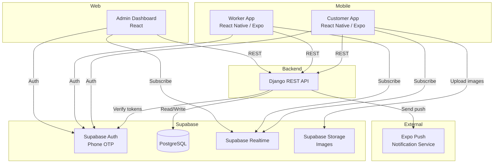
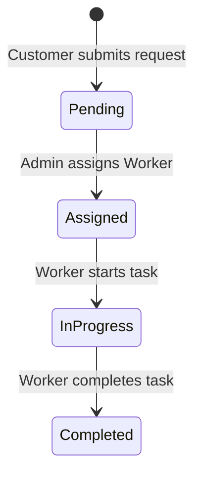

# Design Document: Delivery Platform

## Overview

The delivery platform is an on-demand service connecting Customers with Workers to fulfill three service types: Buy Something, Pick and Drop, and Run Errand. The system consists of four main clients — a Customer mobile app, a Worker mobile app, an Admin web dashboard, and a Django REST API backend — all backed by Supabase (PostgreSQL + Auth).

The core flow is: Customer creates a request → Admin reviews and assigns a Worker → Worker executes and updates status → Customer receives real-time updates throughout.

Key design decisions:
- **Supabase Auth** handles phone/OTP authentication for both Customers and Workers, eliminating custom auth logic.
- **Supabase Realtime** (PostgreSQL change streams) drives live updates to all clients, avoiding a separate WebSocket server.
- **Django REST Framework** owns all business logic, validation, and status transitions; Supabase is treated as the data/auth layer.
- **Expo Location + Push Notifications** handle GPS tracking and notifications on mobile.

---

## Architecture



### Request Lifecycle



### Authentication Flow

All clients authenticate via Supabase Auth (phone + OTP). After successful OTP verification, Supabase issues a JWT. All API calls include this JWT in the `Authorization: Bearer <token>` header. Django verifies the JWT against Supabase's public key and extracts the user identity.

Worker accounts are pre-created by Admins. Admin accounts are seeded directly in the database with a special role flag.

---

## Components and Interfaces

### Customer App

| Screen | Key Functionality |
|---|---|
| Phone Entry / OTP | Supabase Auth sign-in with phone |
| Home | Location display, 3 service cards |
| Request Form (Buy Something) | Multi-step form, image upload |
| Request Form (Pick and Drop) | Multi-step form |
| Request Form (Run Errand) | Multi-step form |
| Tasks Tab | Active + past task list with real-time status |
| Task Detail | Full details, status badge |
| Profile Tab | Name edit, notification preferences |

### Worker App

| Screen | Key Functionality |
|---|---|
| Login / OTP | Supabase Auth sign-in with phone |
| Task Dashboard | Assigned tasks list |
| Task Detail | Full details, Start / Complete actions |
| Profile | Name, Worker ID, Online/Offline toggle |

### Admin Dashboard

| View | Key Functionality |
|---|---|
| Requests List | Filterable by status, real-time updates |
| Request Detail | Full details + assign worker action |
| Worker Assignment Modal | Worker list with availability |
| Worker Management | CRUD for worker accounts, enable/disable |
| Operations Overview | Daily summary counts, completed tasks by date |
| Live Map | Worker location markers for in-progress tasks |

### Django REST API Endpoints

```
# Auth
POST   /api/auth/register-push-token/     # Store Expo push token

# Customers
GET    /api/customers/me/                 # Get own profile
PATCH  /api/customers/me/                 # Update name

# Requests
POST   /api/requests/                     # Create request (Customer)
GET    /api/requests/                     # List requests (Admin: all, Customer: own)
GET    /api/requests/{id}/                # Get request detail
PATCH  /api/requests/{id}/assign/         # Assign worker (Admin)

# Tasks (assigned requests)
GET    /api/tasks/                        # Worker: own tasks; Admin: all
PATCH  /api/tasks/{id}/start/             # Worker starts task
PATCH  /api/tasks/{id}/complete/          # Worker completes task

# Workers
GET    /api/workers/                      # List workers (Admin)
POST   /api/workers/                      # Create worker (Admin)
PATCH  /api/workers/{id}/                 # Edit worker (Admin)
PATCH  /api/workers/{id}/toggle-status/   # Enable/disable (Admin)
PATCH  /api/workers/{id}/availability/    # Worker sets online/offline

# Location
POST   /api/location/                     # Worker posts GPS coordinates

# Notifications
GET    /api/notifications/preferences/    # Customer gets prefs
PATCH  /api/notifications/preferences/    # Customer updates prefs
```

### Real-time Subscriptions (Supabase Realtime)

Clients subscribe to PostgreSQL table changes via Supabase Realtime channels:

| Client | Table | Event | Purpose |
|---|---|---|---|
| Customer App | `requests` | UPDATE (own rows) | Live status updates |
| Worker App | `requests` | INSERT/UPDATE (assigned to worker) | New task assigned, status sync |
| Admin Dashboard | `requests` | INSERT/UPDATE | Live request list |
| Admin Dashboard | `worker_locations` | INSERT | Live location markers |

---

## Data Models

### `profiles` (extends Supabase `auth.users`)

```sql
CREATE TABLE profiles (
    id          UUID PRIMARY KEY REFERENCES auth.users(id),
    role        TEXT NOT NULL CHECK (role IN ('customer', 'worker', 'admin')),
    name        TEXT,
    phone       TEXT NOT NULL,
    created_at  TIMESTAMPTZ DEFAULT NOW()
);
```

### `workers`

```sql
CREATE TABLE workers (
    id              UUID PRIMARY KEY REFERENCES profiles(id),
    worker_id       TEXT UNIQUE NOT NULL,   -- human-readable ID e.g. "WRK-001"
    is_enabled      BOOLEAN DEFAULT TRUE,
    availability    TEXT DEFAULT 'offline' CHECK (availability IN ('online', 'offline')),
    expo_push_token TEXT
);
```

### `customers`

```sql
CREATE TABLE customers (
    id              UUID PRIMARY KEY REFERENCES profiles(id),
    expo_push_token TEXT,
    notif_assigned  BOOLEAN DEFAULT TRUE,
    notif_progress  BOOLEAN DEFAULT TRUE,
    notif_completed BOOLEAN DEFAULT TRUE
);
```

### `requests`

```sql
CREATE TABLE requests (
    id              UUID PRIMARY KEY DEFAULT gen_random_uuid(),
    readable_id     TEXT UNIQUE NOT NULL,   -- e.g. "REQ-20240115-001"
    customer_id     UUID NOT NULL REFERENCES customers(id),
    worker_id       UUID REFERENCES workers(id),
    service_type    TEXT NOT NULL CHECK (service_type IN ('buy_something', 'pick_and_drop', 'run_errand')),
    status          TEXT NOT NULL DEFAULT 'pending'
                        CHECK (status IN ('pending', 'assigned', 'in_progress', 'completed')),
    form_data       JSONB NOT NULL,         -- service-type-specific fields
    image_urls      TEXT[] DEFAULT '{}',
    created_at      TIMESTAMPTZ DEFAULT NOW(),
    updated_at      TIMESTAMPTZ DEFAULT NOW()
);
```

`form_data` shape by service type:

```json
// buy_something
{
  "item_name": "string",
  "item_description": "string",
  "estimated_price": "number",
  "store_name": "string",
  "delivery_address": "string"
}

// pick_and_drop
{
  "pickup_address": "string",
  "delivery_address": "string",
  "package_description": "string",
  "package_size": "small|medium|large",
  "recipient_name": "string",
  "recipient_phone": "string"
}

// run_errand
{
  "errand_description": "string",
  "locations": ["string"],
  "estimated_budget": "number",
  "special_instructions": "string"
}
```

### `worker_locations`

```sql
CREATE TABLE worker_locations (
    id          UUID PRIMARY KEY DEFAULT gen_random_uuid(),
    worker_id   UUID NOT NULL REFERENCES workers(id),
    request_id  UUID NOT NULL REFERENCES requests(id),
    latitude    DOUBLE PRECISION NOT NULL,
    longitude   DOUBLE PRECISION NOT NULL,
    recorded_at TIMESTAMPTZ DEFAULT NOW()
);
```

Only the latest row per `(worker_id, request_id)` is used for live display. An upsert strategy or a separate `current_location` table can be used to avoid unbounded growth.

### `admin_notifications`

```sql
CREATE TABLE admin_notifications (
    id          UUID PRIMARY KEY DEFAULT gen_random_uuid(),
    request_id  UUID NOT NULL REFERENCES requests(id),
    seen        BOOLEAN DEFAULT FALSE,
    created_at  TIMESTAMPTZ DEFAULT NOW()
);
```

### Readable ID Generation

`readable_id` is generated server-side in Django using the pattern `REQ-{YYYYMMDD}-{sequence}`, where sequence is a zero-padded daily counter derived from a database sequence or count query.

---
